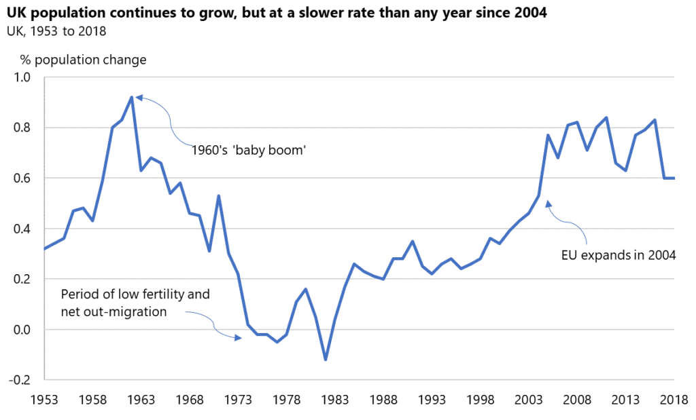
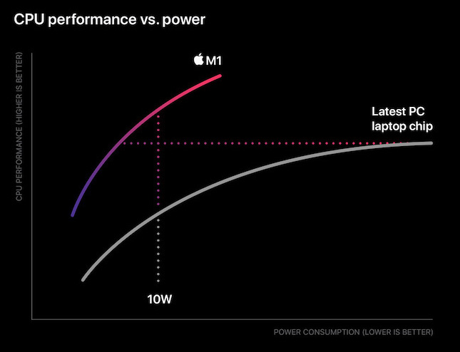
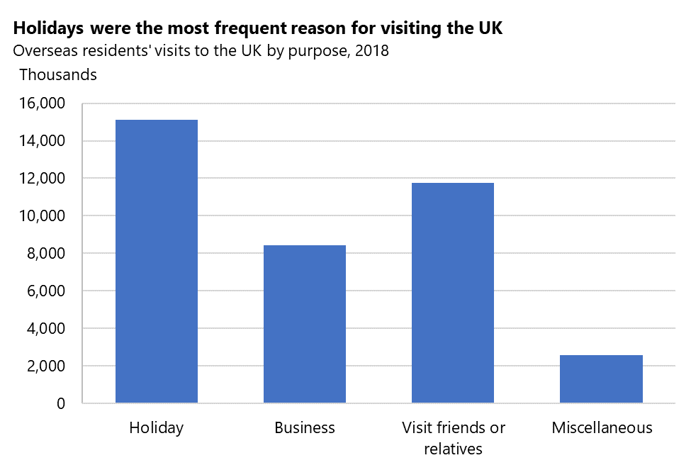
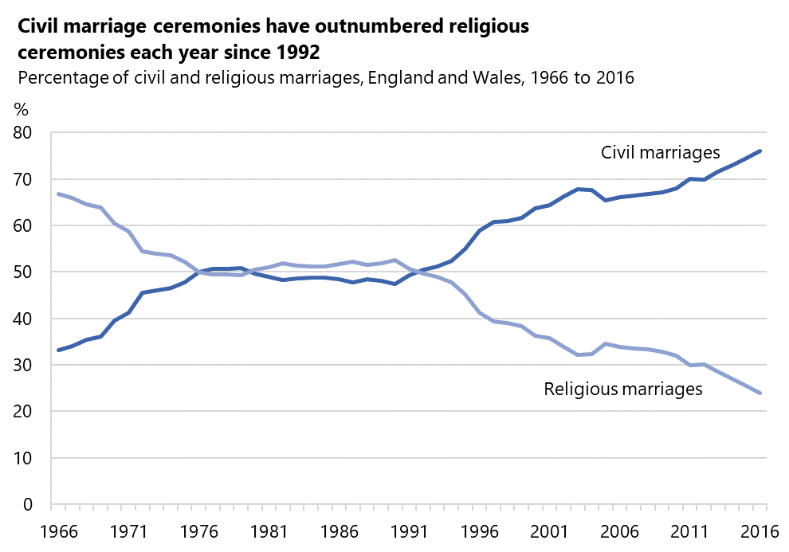
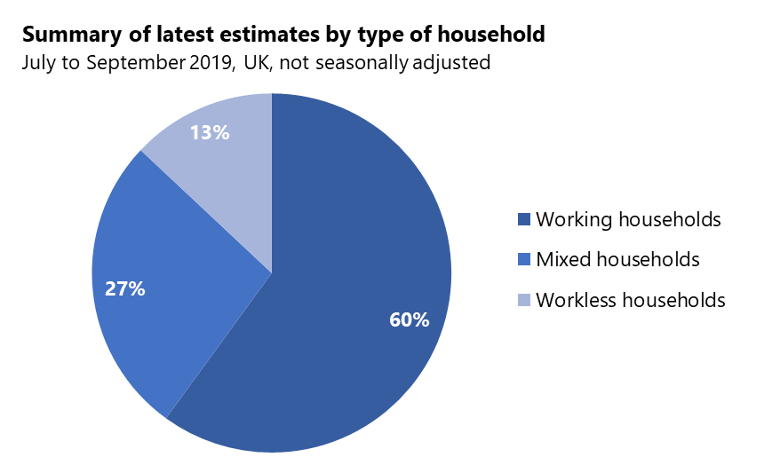
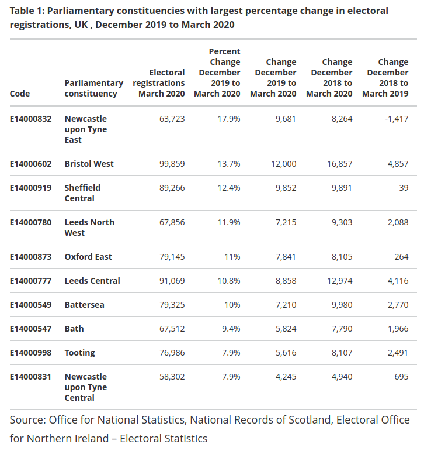

# Introduction to Data Visualisation

Data visualization is the graphical representation of information and data. By using visual elements like charts, graphs, and maps, it provides an accessible way to see and understand trends, outliers, and patterns in data.

In Python, data visualization means using libraries like `Matplotlib`, `Seaborn`, and `Plotly` to turn raw numbers (e.g., in `pandas DataFrames`) into meaningful visuals.

## What is Data Visualization?

- A graphical representation of any data or information
- Visual elements such as charts, graphs, tables and maps, providing viewers with an easy and accessible way of understanding company' information
- Assists in understanding patterns or trends in data that wouldn't be spotted in raw data
- Used in all aspects of industries

## Why is it Important?

There are a range of valuable benefits to organisations from having effective visualisations. They allow you to:

- Spot patterns quickly
- Display complex data intuitively
- Communicate insights to stakeholders in an easily digestible manner
- Reveals correlations to establishes relationships between data
- Detect outliers (unusual data point(s))
- Understand distributions, missing data, and relationships
- Tell a story, which is important for providing context to data
- Share conclusions and summaries, without revealing underlying data which may be sensitive.

## Data Storytelling

Data visualisation are a crucial part of data storytelling, which is the practice of combining accurate data, compelling visuals, and a structured narrative, to turn complex information into actionable insights. Unlike standard dashboards that simply show **what is happening**, data storytelling explains **why it matters** and **what should be done next**.

There are a few different frameworks to guide you in writing a story, but in general you should try to provide:

- **Context**: The problem, scenario, industry, question...
- **Insight**: Something revealed by the data, such as a trend, a change, or a pattern, illustrated by visualisations.
- **Story**: A narrative that explains the insight, which is supported by the data, and reinforced by further visuals.
- **Action**: A recommendation for next steps to remediate, mitigate, or exploit the insight.

Example (*marketing company*):

- **Context**: Long-form *deep-dive* articles get 70% fewer views than short-form clips.
- **Insight**: Although views are lower, 65% of high-value leads read an article before converting.
- **Story**: "Short-form video is best for *awareness*, but our long videos convert more sales. Deciding marketing budgets based on view count will negatively impact sales.
- **Action**: Use the short-form videos specifically to drive traffic to the deep-dive articles.

## Common Visualisation Tools

There are many industry standard tools out there to help us create visualisations. Some popular ones include:

- Tableau: A business intelligence tool for visualisations
- Microsoft Power BI: Another business intelligence tool
- MatLab: A data analysis tool with an easy-to-use tool interface and graphical options

There are also many different data visualisation libraries for Python.

|Library|Use Case|Difficulty|
|---|---|---|
|Matplotlib|The OG data visualisation tool, many others, such as Pandas, are built on top of it|Medium|
|Seaborn|Statistical plots; works well with pandas; prettier defaults|Easy|
|Plotly|Interactive plots (zoom, hover, click); dashboards|Easy/Medium|
|Pandas `.plot()`|Quick, simple plots directly from DataFrames (uses Matplotlib)|Very easy|

*For this module we'll be using `MatPlotLib` along with `Jupyter Notebooks`, we'll come back to them shortly.*

## Visualisation Considerations

The following considerations will help you plan a data visualisation project:

- Know the audience / who is going to be viewing it
  - What information is relevant to them?
  - What level of depth will they understand?
  - Do they just want information, or recommendations?
- Set goals for what you want to convey through the viz
  - Your goals should not assume the outcome:
    - **Good**: "*I want to explore the relationship between x and y*"
    - **Bad**: "*I want to show that when x increases y increases*"
  - Ensure your goals relate to relevant questions
- Choose a relevant chart type that best represents the data
  - Different charts are better for different purposes, for example line charts are good for time-series data, bar charts for comparisons, and so on.
- Use a colour scheme that represents different aspects of the data
  - Choose colours that are easy to differentiate
  - Ensure that you are consistent so colours/categories can be followed across charts.
- Use the best tools for the job

## Chart Types

Charts are the typical output of data visualisation operations, there are a variety of different types, some you're likely familiar with, and some might be new to you.

### Components of Effective Graphs

Not all components outlined in the following slides must be included in every graph. However, it's essential to consider them when designing your graph. The primary question you should be asking is...

> **Does this element make my graph easier to understand and interpret?**

- **Title**: Provide a concise and descriptive title that summarizes the main message
- **Axes**: Label each axis clearly, indicating what is plotted on both axes of the graph. Include relevant units, if applicable. For self-explanatory axes, such as years, labels may be optional
- **Scale**: Choose an appropriate scale for both axes to ensure that the data is displayed clearly and accurately. Consider using logarithmic scales if necessary
- **Annotations**: Incorporate annotations to emphasize key areas, guide the viewer's attention
- **Legend**: Include a legend if multiple data series or points are represented by different colors, symbols, or line styles. Ensure the legend is clear, concise, and easy to read
- **Data visualization type**: Select the most appropriate type of graph for your data, such as bar graphs, line charts, scatter plots, or pie charts, based on the data you want to present
- **Consistent formatting**: Use consistent formatting for elements like fonts, colors, and line styles to make your graph aesthetically pleasing and easy to understand
- **Grid lines**: Consider adding grid lines to improve readability, especially when dealing with large datasets or complex graphs. However, avoid cluttering the graph with too many lines
- **Citing data sources**: If you are using data from external sources, provide proper attribution and citations at the bottom of your graph or in the accompanying notes

#### Example of a good graph

<!-- .element: class="centered" -->

_Source: Office for National Statistics_

---

#### Example of a bad graph

<!-- .element: class="centered" -->

_Source: Apple_

Why is this a bad graph? (click to reveal)

Are the Axis linear?

What is Power measured in? Horse Power?

What is CPU Performance measured in?

What is the latest PC laptop chip?

Axis values? Do they start at zero or other value?

What do the dotted lines show? Not immediately clear!

### Bar Graphs

- Work well for comparing the magnitude of different categories
- Can also be used to show time-series, deviation and distributions
- Have either horizontal or vertical bars

---

**Deviation** is a measure of difference between the observed value of a variable and another value, typically the variable's mean.

**Probability distribution** is the mathematical function that gives the probabilities of occurrence of different possible outcomes for an experiment.

We won't be delving into statistics, don't worry.

---

### Example

<!-- .element: class="centered" -->

_Source: Office for National Statistics - International Passenger Survey_

---

### Line Graphs

- Displays information as a series of points connected by straight line segments
- Often used to visualise a trend in data over a time series

### Example

<!-- .element: class="centered" -->

_Source: Office for National Statistics - Marriages in England and Wales_

---

### Pie/Donut Chart

- Works well for clearly showing *parts-of-a-whole* relationships, but use with caution.
  - If segments are of a similar size it can be difficult to differentiate them (without labels).
  - If you need to clearly show which ones are larger, consider a bar graph.
- Effective at conveying dominant categories, when one category significantly outweighs others
- Donut charts differ slightly to pie - the centre is a convenient place to show the total value for the sum of the parts

Use one if:

- There are five or fewer categories, and values are not similar
- Categories are sufficiently related
- You need to break up a page of bar graphs

### Example

<!-- .element: class="centered" -->

_Source: Office for National Statistics - Household Labour Force Survey_

---

### Tables

Sometimes tables are the best way to present numbers in a clear, logical, and systematic way, however, it is harder for viewers to see patterns in a table than a graph.

Use a table to show multiple unrelated values at once, however, if the values are related, then a graph would be more appropriate

A table is better if:

- You ask the viewer to compare individual values
- You want to include summary statistics such as `means` or `totals`
- You want to include values and measures such as `percentages`
- There is no `trend` / `pattern` / `relationship` between the values

### Example

<!-- .element: class="centered" -->

_Source: Office for National Statistics - Parliamentary constituencies with largest percentage change in electoral registrations_

---

### Finding the Right Balance

Ultimately, the best graphing technique depends on your unique context and goals.

Consider the following when choosing a graph type:

- Purpose and audience
- Data type and story

> Remember: Use the graphing medium that best represents your data!

## Why not just use Excel?

Excel is a great tool for data management, but it can create problems. Usually because people use it as database, or they introduce human errors into their formulas and/or data.

- It struggles with data types - it autodetects values, so for example, when adding a phone number to a cell it will usually drop any leading zeros; With long numbers, like phone and credit card numbers, it has a habit of truncating them to scientific notation.
- Spreadsheets do have a size limit - the number of rows used to be limited by a 16-bit number, which maxed out at ~65k; It's since been updated to a little over 1 million - *which is still often insufficient*.
- Spreadsheets are used by normal humans (alongside the super-human data scientists), which means they're vulnerable to human errors.
  - Hiding cells instead of deleting them cost [Barclay's bank millions](https://www.businessinsider.com/2008/10/barclays-excel-error-results-in-lehman-chaos) during the 2008 meltdown.
  - A cut and paste error cost [TransAlta $24 million](https://www.theregister.com/2003/06/19/excel_snafu_costs_firm_24m/).
  - An error cost [JP Morgan $6 billion](https://www.reuters.com/article/jpmorgan-var-idUSL1E8GBKS920120511/) when a Value at Risk model was miscalculated based on the sum of other values, rather than the mean.

>Excel doesn't know if a value is wrong, it just calculates what you give it.

Many of these problems can be mitigated by choosing the appropriate tools from your data science toolkit, or simply *use a real database*, **LIKE AN ADULT**.
