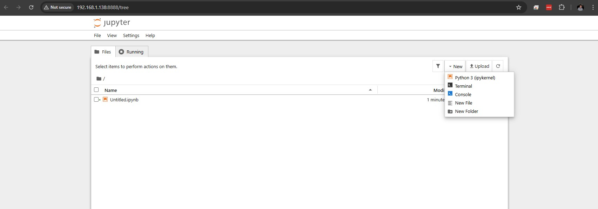

# Jupyter Notebooks Deployment Guide

To practice data science skills in a live production-like environment, we're going to use Jupyter Notebooks

A Jupyter Notebooks are an interactive web-based environment where you can write and run Python code, see visualizations inline, add markdown explanations, and share a single file (.ipynb).

Why it’s great for visualization beginners

- `Iterative`: Change a plot, re-run the cell, see result immediately.
- `Documentation` + `code` + `output` in one place.
- No need to re-run entire script – **run only the cell you’re working on**.

To closer align with industry standards, we're going to deploy our Jupyter Notebook within an environment called Miniconda (Anaconda), which will be hosted in a Docker container.

## Anaconda

We don't really need to interact directly with Anaconda, but an overview is provided for context.

### Anaconda and Miniconda

Anaconda is a Python (and R) distribution designed specifically for data science and machine learning. It comes bundled with:

- Python
- `Conda` (package & environment manager)
- Jupyter Notebook/Lab
- 250+ pre-installed data science packages (e.g. numpy, pandas, matplotlib, scikit-learn, etc.)
- Anaconda Navigator (GUI launcher)

**Miniconda** is the lightweight version, it includes only Python + Conda. You install only the packages you need.

|Feature|Anaconda|Miniconda|
|---|---|---|
|Size|~3-5 GB|~400-500 MB|
|Pre-installed packages|250+|None: just Conda + Python|
|Best for|Beginners, teams, enterprise|Advanced users, containerized apps, slow internet|
|GUI Navigator|Yes|No|

For our purposes Miniconda with a basic `requirements.txt` file is sufficient.

## Jupyter Notebook

Jupyter Notebooks can be used for:

- Data visualisation
- Data cleaning / transformation
- Statistical modelling
- Machine Learning
- And more...

Files are saved as `.ipynb` (`JSON`-based) and can be exported to `HTML`, `PDF`, `Python` scripts, or `Markdown`.

>A VSCode extension is available to work with Jupyter Notebooks. You may use this if you cannot access a VM/Docker deployment.


### When to use Jupyter Notebooks?

Jupyter Notebook offers unique features compared to standard Python scripts. Consider using it:

- For remote execution on servers or in Docker containers
- During presentations with real-time data analysis
- To combine code and markdown documentation
- To utilise built-in features, e.g. magic commands (`%sql`)
- For exploratory coding with line-by-line execution
- To facilitate collaboration and sharing of code/results

Choose Jupyter Notebook when it enhances your workflow and presentation.

## Deploying Jupyter Notebooks

You should have a working Docker environment (for deployment instructions [click here](https://github.com/Generation-UK-I/DE-NAT4-TECH-CONTENT/blob/main/Linux-Docker/installing-docker.md))

Complete the following steps to deploy Miniconda and Jupyter Notebook:

1. Launch your CentOS VM (restore to a clean backup if messy)
2. Verify Docker is running with `docker --version` or `docker ps`
3. Create a new working directory for your data visualisation module, and move into it.
4. Create a new file called `dockerfile` and open it with you preferred text editor.
5. Paste the below text into your dockerfile, save, and close.

```bash
FROM continuumio/miniconda3

# Copy your requirements file into the image
COPY requirements.txt /tmp/requirements.txt

# Install Python dependencies
RUN pip install --no-cache-dir -r /tmp/requirements.txt

# Install Jupyter
RUN conda install jupyter -y --quiet

# Create a working directory
RUN mkdir /opt/notebooks
WORKDIR /opt/notebooks

# Expose Jupyter port
EXPOSE 8888

# Runs Jupyter Notebook and binds it to all interfaces so you can access it from the host.
CMD ["jupyter", "notebook", "--notebook-dir=/opt/notebooks", "--ip=0.0.0.0", "--port=8888", "--no-browser", "--allow-root"]
```

The `CMD` section contains commands to run in the container on deployment:

- `jupyter notebook`: starts the jupyter notebook server
- `--notebook-dir=/opt/notebooks`: Sets the working directory Jupyter will serve notebooks from /opt/notebooks. Below we use a volume mount to persist notebooks from this location to our host.
- `--ip=0.0.0.0`: Binds the server to all network interfaces. Required so the container can accept connections from outside, such as from your host machine’s browser.
- `--port=8888`: Runs the Jupyter server on port 8888; this must match or be mapped to the host port when running the container (`-p 8888:8888`)
- `--no-browser`: Prevents Jupyter from trying to open a web browser automatically - Essential in Docker (no display/browser available).
- `--allow-root`: Normally Jupyter doesn't run as root for security reasons, but in many Docker containers, you only have root.

6. Create a new text file called `requirements.txt` file. It contains a list of Python packages that your environment needs in order to run your notebooks, Docker uses it so the container can install everything automatically. Add the following to the file:

```text
numpy
pandas
matplotlib
```

>In production you will include the version numbers of the dependencies, specifically, the versions your app was developed and tested with; Without version numbers the latest will be installed.

7. Run the following command to build your image.

```bash
sudo docker build -t my-conda-notebook .
```

- `build`: Builds an image using a dockerfile
- `-t`: Assigns a name tag to the image, in our case my-conda-notebook
- `.`: Current working directory

```bash
sudo docker run -it --rm   -p 8888:8888   -v $(pwd)/notebooks:/opt/notebooks   my-conda-notebook
```

- `docker run`: Creates and starts a new container from the specified image
- `-it`: Two flags combined: `-i` (interactive) – Keeps STDIN open, allowing you to interact with the container; `-t` (pseudo-TTY) – Allocates a terminal session (makes output formatted properly)
- `--rm`: Automatically removes the container when it stops/exits. Data stored in the container is lost.
- `-p 8888:8888`: Maps port 8888 on your host machine to port 8888 inside the container.
  - Format: `<host_port>:<container_port>`.
- `-v $(pwd)/notebooks:/opt/notebooks`: Syncs host folder with container folder so notebooks saved in container go directly to your host. This allows your notebooks to persist even after container is removed; Matches `--notebook-dir=/opt/notebooks` in dockerfile.
  - Format: `<host_path>:<container_path>`
  - `$(pwd)`: Bash syntax to recall a variable, in this case the present working directory.
  (bidirectional)

8. Once deployed you should see output similar to the following (*we see this because we used the `-it` flags*):

```bash
...
[I 2026-04-17 23:18:23.667 ServerApp]     http://127.0.0.1:8888/tree?token=08a4d7d2e5e2e0eb833bc2968a84b4bd5e501b66aa3f308b
[I 2026-04-17 23:18:23.667 ServerApp] Use Control-C to stop this server and shut down all kernels (twice to skip confirmation).
[C 2026-04-17 23:18:23.669 ServerApp]

    To access the server, open this file in a browser:
        file:///root/.local/share/jupyter/runtime/jpserver-1-open.html
    Or copy and paste one of these URLs:
        http://1dd519301a14:8888/tree?token=08a4d7d2e5e2e0eb833bc2968a84b4bd5e501b66aa3f308b
        http://127.0.0.1:8888/tree?token=08a4d7d2e5e2e0eb833bc2968a84b4bd5e501b66aa3f308b
[I 2026-04-17 23:18:23.683 ServerApp] Skipped non-installed server(s): basedpyright, bash-language-server, dockerfile-language-server-nodejs, javascript-typescript-langserver...
```

9. Look for the line that says: `http://127.0.0.1:8888/tree?token=08a4d7d2e5e2e0eb833bc2968a84b4bd5e501b66aa3f308b` (your token will be different). Copy and paste this line into your browser' address bar, but DON'T press ENTER. *Notice also, that it says "Use Control+C to stop this server..."*

>You can disable authentication (*Google the correct flags and add the to the CMD section of your dockerfile*), but this is not advisable.

10. Replace the localhost IP (127.0.0.1) with your VM's IP address (e.g. 192.168.1.XX) then press ENTER.

>Replace only the IP, everything from `:8888...` should not be changed.



You should see the landing page of Jupyter. Create a new Python 3 Notebook in the upper-right and start experimenting, or move onto the [Jupyter tutorial](./jupyter-tutorial.md)
