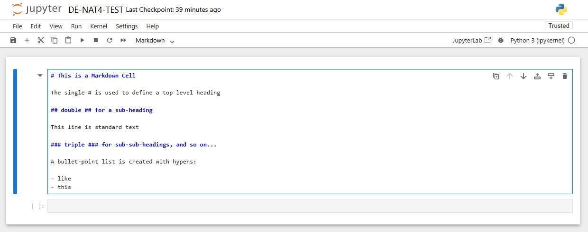
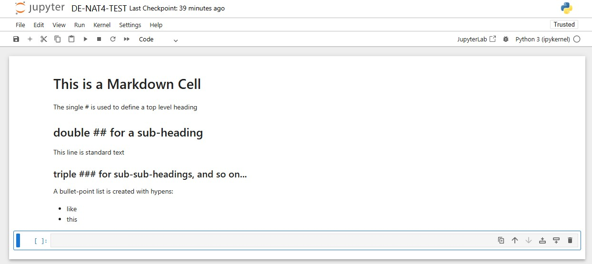
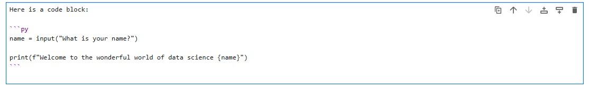
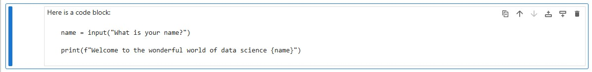
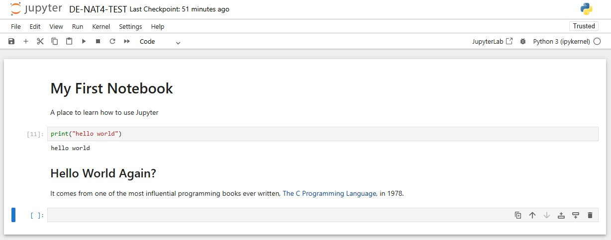
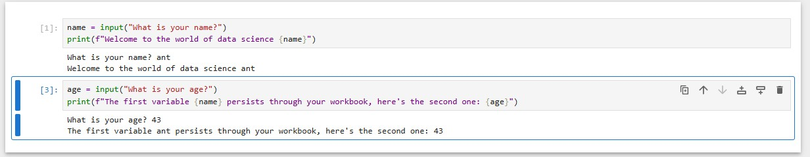

# Introduction to Jupyter Notebooks

An open-source web-based interactive computing environment that allows you to create and share documents containing live code, equations, visualisations, explanatory text and more. The ability to blend all of these into a single document makes it a great tool for telling stories.

## Working with Cells

When you first log into Jupyter you'll see the front page with any notebooks you've saved previously. In the top-right you can upload existing notebooks, or under new, you can open a terminal, create directories for organising your resources, or create a new notebook by selecting `Python 3 (ipykernel)`.

>`ipykernel`: A package providing a computational backend for your notebooks.


The key object we use to add text and code to our notebooks is the cell, into which we can write code, markdown (formatted text), or RAW text.

---

### Markdown

Markdown is a language for creating formatted text. Editors such as Word use a 'what you see is what you get' (WYSIWYG - "wizzywig") model, in which you click buttons and menus to change the rendered text on screen. This is often facilitated by proprietary hidden characters and techniques, which creates challenges:

- Files are harder to share due to users requiring a specific editor/app
- Formatting is often applied with hidden characters, which can cause unexpected outcomes when copy/pasting code
- Formatting can be inconsistent across platforms - formatting may be stripped if unreadable

By comparision, markdown is:

- Standardised, many different apps and environments support markdown, and it renders the same everywhere
  - Think of it like HTML, any browser will render a website written in HTML the same way
- It is platform independent, you won't encounter issues with file types not being supported
- Markdown is future proof; MD files you write now can be read and written by older and future apps

MD allows you to create complex, richly formatted, accessible documents by utilising a wide range of special characters and syntax. It is commonly used for websites, presentations, technical documentation, GitHub repo' readme files, and much more.

Here you can see some RAW markdown entered into a cell:



If you execute the cell (`PLAY` button, or `SHIFT+CTRL`) it renders the MD as seen here:



Use this [markdown cheat sheet](https://www.markdownguide.org/cheat-sheet/) to look up the syntax for the formatting features you require

#### Code in Markdown

One useful feature of markdown is it's ability to display and format code correctly, you've seen lots of examples of this in the tutorial documents you've worked through.

To create a code block you surround your code with three backticks **```** before it, and three after (*on most keyboards this is to the left of the number 1*), be careful, it looks like an apostrophe.



After the three opening backticks you can state the language you're using for correct formatting; Most common ones are supported, but for our purposes you'll likely use `bash`, `py`, and `text`.

When executed in Jupyter it looks like this (you've seen many examples of how it looks in VSC):



The last useful bit of syntax is to `highlight` a single piece of `code` or a `keyword` inline with your text, this is done by surrounding the code/word(s) with a single backtick (`).

>Some markdown features, such as code recognition, are part of the `extended` syntax, and not supported by all markdown readers.

---

With Jupyter you can write code directly into cells, and execute them in place, inline with your markdown cells.



### Useful Jupyter Shortcuts

Jupyter provides a comprehensive GUI, but also an efficient set of shortcuts to make working with just the keyboard easy and fast.

The key buttons and menu options can be accessed from the keyboard using `COMMAND` mode, when you type into cells you're using `EDIT` mode.

- When in `EDIT` mode, switch to `COMMAND` mode with `ESC`
- When in `COMMAND` mode, switch to `EDIT` mode by pressing `ENTER` with a cell highlighted.

|Action|Key combo|
|---|---|
|**EDIT MODE**|(most standard keyboard inputs and shortcuts work as expected)|
|Run current cell|`SHIFT+CTRL`|
|Run current cell and insert below|`SHIFT+ENTER`|
|**COMMAND MODE**|Press `ESC` from edit mode|
|Return to INSERT mode|`ENTER`|
|Insert cell below|`B`|
|Insert cell above|`A`|
|Cut/Copy/Paste selected cells|`X`/`C`/`V`|
|Delete selected cells|`D,D` (press twice)|
|Change cell to markdown|`M`|
|Change cell to code|`Y`|
|Change cell to RAW (text)|`R`|
|Scroll up/down|`SPACE`/`SHIFT+SPACE`|

Don't worry about memorising them, the ones you use most often will become second nature quickly enough.

### Code Cells

Code cells will accept and run your Python code just like any other environment, any output or input will be provided immediately below the cell.



>We don't get the hints and suggestions like VSC, so a little extra attention to detail is required; This is one advantage of using Jupyter Notebooks through VSC.

## Jupyter Notebook Lab

>NOTE: This lab assumes you have followed the deployment steps in the [deploying Jupyter](./deploying-jupyter.md) guide, including the `requirements.txt` file.

The following lab will familiarise yourself with Jupyter Notebooks, you will use some packages which you can explore in more detail by following the links at the bottom of the page.

1. From the Jupyter front page click `New` > `Python 3 (ipykernel)`. Click `Untitled` at the top, and give your notebook a name.

2. You will likely by in the first cell which is configured for code (indicated by the drop-down menu at the top, and at a glance by the empty `[ ]`). Press `ESC` > `M` > `ENTER` to change the cell to accept markdown, and return to `EDIT` mode.

3. Type the following:

```markdown
# My First Notebook

This notebook explores basic Python, NumPy, Pandas, and Matplotlib.

The next cell demonstrates running some simple Python code.
```

4. Press `SHIFT`+`ENTER` to execute the cell (render the markdown) and move to the next cell, which will be expecting code (if it's still markdown press `ESC` > `Y` > `ENTER`).

5. Type the following into the next cell, and press `SHIFT`+`ENTER` to execute the code:

```py
name = "Alex"
age = 25

print("Name:", name)
print("Age:", age)
```

6. Change the next cell to markdown, and add: `Here is my first NumPy array`, then execute.

7. Ensure the next cell is code, enter the following, and execute:

```py
import numpy as np

numbers = np.array([1, 2, 3, 4, 5])

print("Array:", numbers)
print("Mean:", np.mean(numbers))
print("Sum:", np.sum(numbers))
```

8. Change the next cell to markdown, and add: `Here is my first Pandas Dataframe`, then execute.

9. Ensure the next cell is code, enter the following, and execute:

```py
import pandas as pd

data = {
    "Name": ["Alice", "Bob", "Charlie"],
    "Score": [85, 90, 78]
}

df = pd.DataFrame(data)
print(df)
```

10. Change the next cell to markdown, and add: `Here is my first plot with Matplotlib`, then execute.

11. Ensure the next cell is code, enter the following, and execute:

```py
import matplotlib.pyplot as plt

scores = [85, 90, 78]

plt.plot(scores)
plt.title("Student Scores")
plt.xlabel("Student Index")
plt.ylabel("Score")

plt.show()
```

12. Change the next cell to markdown, and add: `Pandas and Matplotlib are both based on NumPy, so the next example uses all three`, then execute.

13. Ensure the next cell is code, enter the following, and execute:

```py
import pandas as pd
import matplotlib.pyplot as plt

data = {
    "Day": ["Mon", "Tue", "Wed", "Thu", "Fri"],
    "Steps": [5000, 7000, 8000, 6500, 9000]
}

df = pd.DataFrame(data)

plt.bar(df["Day"], df["Steps"])
plt.title("Steps per Day")
plt.show()
```

### Mini Challenge

Copy the code above into a new cell, think of some other data which could be compared using a bar graph, and replace the arrays with your new data.

## Jupyter Magics

Magic commands/functions are special commands which can be interpreted by the IPython kernel to provide extra features and functionality, such as debugging, shell access, access to external files, and much more, which can be called from within your notebook.

There are two types of Magics:

### Line magics (`%` - affects one line)

Some common line magic commands include:

```python
%who                              # List variables
%reset                            # Clear all variables
%run script.py                    # Run external Python file
%load script.py                   # Load script into cell
%pwd                              # Print working directory
%cd /path/to/dir                  # Change directory
%ls                               # List files
```

### Cell magics (`%%` - affects entire cell)

Try the following Cell magics:

```python
%%time
# Time entire cell
total = 0
for i in range(1000000):
    total += i
print(total)

%%writefile my_script.py
# Save cell content to file
print("Hello from file!")

%%bash
# Run bash commands
echo "Current date:"
date
ls -la

%%html
# Render HTML
<h1>Big Title</h1>
<div style="color:red">Red text</div>
```

## Some Jupyter Do's and Don'ts

**Do**:

- Use markdown cells to document your thought process
- Add section headings to organize long notebooks
- Use meaningful variable names
- Clear output before committing to version control
- Restart kernel and run all before sharing
- Use comments in code cells

**Don't**:

- Leave large outputs (DataFrames with 1000s of rows)
- Hardcode file paths (use relative paths)
- Run all cells without understanding the flow
- Share notebooks with API keys/passwords

## Explore Python Data-Science Packages

- [Introduction to NumPy](./numpy/intro_numpy.md)
- [Introduction to Pandas](./pandas/intro_pandas.md)
- [Introduction to MatPlotLib](./matplotlib/intro_matplotlib.md)
